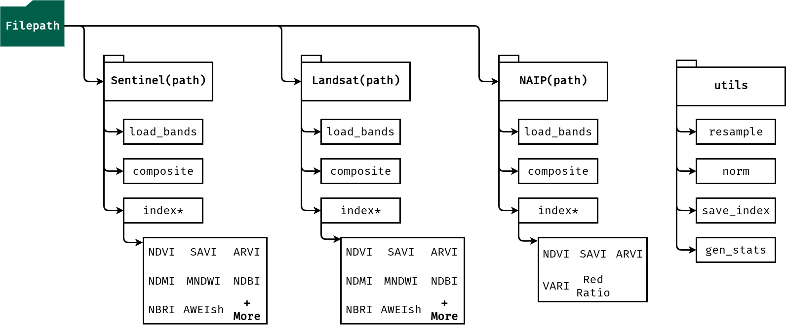

# Summary 
The public availability of multispectral satellite imagery combined with the high temporal frequency with which it is taken allows for imagery to be incorporated into many aspects of research.
The uses of indices from remote sensing products range from tracking vegetation health, monitoring forest canopy, observing water levels, fire detection, and even aiding in the creation of land cover datasets [@Silleos:2006; @Joshi:2006; @Ghulam:2007; @Roy:2006; @Jin:2013].
Indices are computed through the application of algebraic formulas where the inputs are either the spectral bands or other ancillary information from multispectral imagery.
However, outside of raster calculator GUI's, like those in proprietary geospatial software’s such as ArcGIS and ERDAS, and in the open source QGIS, there is currently no streamlined method for calculating these indices.
Additionally, other processing functions are provided such as compositing and cell size resampling.

The goal of Rindcalc is to provide an efficient and seamless processing toolbox for capable of working directly with remote sensing products outside of a GUI or the us of a complex python pipeline from scratch.
The indices created with Rindcalc can subsequently be added to other workflows and algorithms to aid in research.

# Methodology
Rindcalc is seperated by remote sensing product with functionality for Landsat-8, Sentinel-2, and NAIP imagery provided at the time of writing.
For each remote sensing product a class is intitialized which will read the filepaths of each raster band within the image directory utilizing the default naming conventions of each product. 
Each class contains two main dictonary attributes, `paths` and `bands`, both of which follow the same key naming convention where the key of each band is titled "band_band#", e.g. Landsat-8 band seven would be "band_7". 
This naming convention is utilized throughout Rindcalc with the goal of simplifiying the usage of the individual bands.
Furthermore, the usage of the dictonary structure allows the data to be easily qeuryable and allows for only specific bands to only be loaded as arrays for reduced memory usage when working with each remote sensing product.

## Key Modules

* `load_bands`: 
  For each remote sensing product each indvidual band can be read into an array using the `load_bands` method.
  This allows for index formulas to be applied properly to the imagery as each cell can be effiecently computed.

- `composite`:
  For remote sensing products three band composites of varying band combinations are important to highlight various features.
  Rindcalc provides a simple structure to create said composites as the band specification inputs use the naming convention standard within Rindcalc.


# Mathematics

Single dollars ($) are required for inline mathematics e.g. $f(x) = e^{\pi/x}$

Double dollars make self-standing equations:

$$\Theta(x) = \left\{\begin{array}{l}
0\textrm{ if } x < 0\cr
1\textrm{ else}
\end{array}\right.$$

You can also use plain \LaTeX for equations
\begin{equation}\label{eq:fourier}
\hat f(\omega) = \int_{-\infty}^{\infty} f(x) e^{i\omega x} dx
\end{equation}
and refer to \autoref{eq:fourier} from text.

# Citations

Citations to entries in paper.bib should be in
[rMarkdown](http://rmarkdown.rstudio.com/authoring_bibliographies_and_citations.html)
format.

If you want to cite a software repository URL (e.g. something on GitHub without a preferred
citation) then you can do it with the example BibTeX entry below for @fidgit.

For a quick reference, the following citation commands can be used:
- `@author:2001`  ->  "Author et al. (2001)"
- `[@author:2001]` -> "(Author et al., 2001)"
- `[@author1:2001; @author2:2001]` -> "(Author1 et al., 2001; Author2 et al., 2002)"

# Figures

Figures can be included like this:

and referenced from text using \autoref{fig:example}.

Fenced code blocks are rendered with syntax highlighting:
```python
for n in range(10):
    yield f(n)
```	
